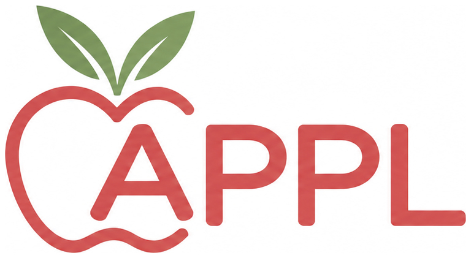

# Agent Priors-guided Policy Learning (APPL)

APPL is an agentic robot learning framework that connects policy learning with agent-based skill selection and composition through structural priors, enabling generalization from a few demonstrations to new scenes and task compositions.

A construction agent segments demonstrations into reusable skills, proposes structural priors, and trains and verifies a policy for each prior. A runtime agent reads interfaces that describe these priors and their applicability to select and compose policies for new task goals. The same structural prior shapes how a policy generalizes during learning and tells the runtime agent when to use it.

- Project page: [APPL](https://agentics-robotics.github.io/APPL/)
- Code: [GitHub](https://github.com/Agentics-robotics/Agent-Priors-guided-Policy-Learning)
- Paper: [arXiv:2609.35690](https://arxiv.org/abs/2609.35690)
- Discussion: [Hugging Face](https://huggingface.co/papers/2609.35690)

This repository holds the static website only (`index.html`, `static/`). The rollout videos are Blender re-renders of logged ManiSkill episodes.

The page includes scholarly citation metadata, Schema.org `ScholarlyArticle` data, and a canonical URL. `sitemap.xml` lists the project page; `llms.txt` is an optional text guide to the same research content and sources, not a guarantee of AI indexing or citation.

Rollout descriptions are pre-rendered into `index.html` so crawlers can read their text without executing JavaScript. After editing `static/data/tasks.json`, run `python3 scripts/render_task_panels.py` and commit the generated HTML with the data. Run `python3 scripts/render_task_panels.py --check` to verify they match. No build step is needed when serving the checked-in website.

For discovery after deployment, submit `https://agentics-robotics.github.io/APPL/sitemap.xml` through the site's verified Google Search Console and Bing Webmaster Tools accounts. This project is hosted under `/APPL/`: crawler rules must be managed at `https://agentics-robotics.github.io/robots.txt`, in the domain-root site's repository. A `/APPL/robots.txt` file would not control crawlers. The domain-root file can also advertise this sitemap. Keep the project-page link in the arXiv record and other public research profiles up to date. Indexing and citations remain up to each search service.
